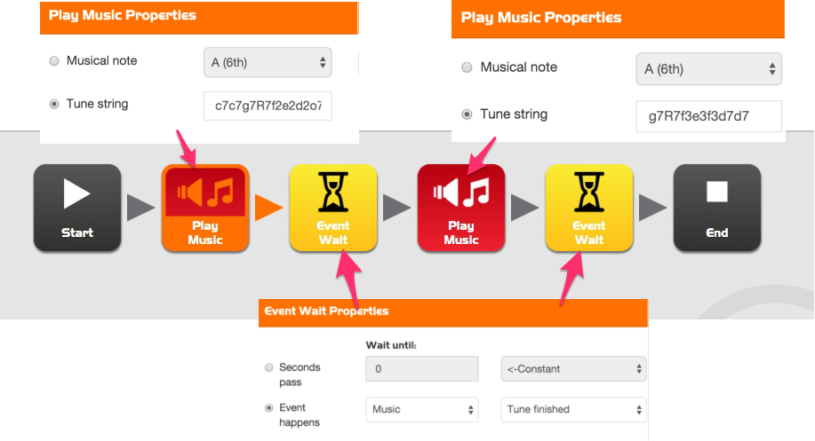

    
# Banbridge Dojo #
# Edison: Blinking, Beeping and Bouncing #

## Introduction

In the following exercises we are going to look at connecting our computer to the **Edison** in order to program our robot's LEDs, Buzzer and Motors and also react to the world around it using input from the robots sensors. These programs will be built up using the online **Edware** application which has an intuitive Drag and Drop interface.

## Resources

You will need the following:

1. Edison Robot (or more if you'd like to tackle the advanced Challenge)
1. EdComm Programming Cable
1. (Optional) Black marker & paper

## A Look at Edison

To use Edison you’re going to need to know where it's sensors are and what it's three buttons do. Have a look at the images below. You may need to come back and have another look as we go through the exercises.

1. **Play button** – Start program
1. **Stop button** – Press to stop a program - very important when your Robot is trying to escape or is making an awful racket!
1. **Record button** – 1 press = download program, 3 presses = read barcode

 

The EdComm cable is used to download your programs to Edison. It connects into the headphone socket on your computer or tablet. Make sure to turn up the **volume to full**. If you are using Windows check that audio enhancements are disabled.

We'll be using the online editor throughout these lesson, but an offline editor can also be installed onto your computer as well:

- [Online Editor](https://edwareapp.com/)
- [Offline Editor](https://meetedison.com/content)

### Exercise 1 - Flash a LED
This first exercise is a simple one which we'll use to make a LED flash. It's also a useful one to check whether we can successfully load our programs onto the Edison before we try out the more complicated exercises (better to fail early than fail late :D)

**Can you:**

1. Drag across the icons to form the program above, then click on each icon and set the properties box as shown.
1. Connect the EdComm cable between Edison and the headphone jack on your computer/tablet.
1. Click the **Program Edison** button, then the record (round) button once on Edison.
1. Now click **Start Download**.
1. Press the play (triangle) button and the left LED will flash on and off.

### How does it work?

1. The program begins at the start icon
1. The program follows the arrow out of the top of the loop icon
1. The LED is set to on by the flash LED icon
1. The program waits for 0.5 seconds by the event wait icon (keep the LED on)
1. The LED is set to off by the flash LED icon
1. The program waits for 0.5 seconds by the event wait icon (keep the LED off)
1. **What happens here is very important!** Rather than following the arrow to the right of the loop end icon, the program moves out of the bottom of the icon and goes back to the loop start icon. This happens because the loop icon is set to ‘Loop forever’. The program therefore once again goes to the first flash LED icon and turns on the LED and then
follows the same sequence outlined above. This will continue forever or at least until the batteries go flat!

### Challenge

1. Try adjusting the event wait times and adding more flash LED icons to control the right LED. Can you make a cool flashing light display?

### Exercise 2 - Let's Play Music

Edison’s little piezo transducer (speaker) can produce a range of musical notes. These are easily programmed from the play music icon. Get started by creating the program below.

**Can you:**

1. Drag across the icons to form the program below, then click on each icon and set the properties box as shown.
1. The tune string in the first play music icon is: c7c7g7R7f2e2d2o7o7g7R7f3e3d3o7o7
1. The tune string in the second play music icon is: g7R7f3e3f3d7d7
1. Connect the EdComm cable between Edison and the headphone jack on your computer/tablet.
1. Click the **Program Edison** button, then the record (round) button once on Edison.
1. Now click **Start Download**.
1. Press the play (triangle) button and the left LED will flash on and off.

### How does it work?

1. The play music icon contains a tune string (more on that below) and the event wait icon waits until the tune is finished.
1. The next play music icon and event wait do the same.
1. There are two sets of icons because a single play music icon will not fit the entire tune.
1. A tune string looks like this: "ndndndndndnd..." where ‘n’ is a note from the following table, and ‘d’ is the note time from 0 to 7 in 20th of a second increments. There is a limit of 16 pairs per play music icon. **R** is a rest or pause.

|character|note|character|note|character|note|
|---------|----|---------|----|---------|----|
|m|A, 6th octave|d|D|g|G|
|M|A#|D|D#|G|G#|
|n|B|e|E|a|A|
|c|C, 7th octave|f|F|A|A#|
|C|C#|F|F#|b|B|

## Exercise 3 – Edison the guard dog!

We can use Edison’s light sensors to trigger an alarm. This could be used as a cupboard alarm. Place Edison running this program in a cupboard, then if someone opens the cupboard and allows light in, Edison sounds the alarm.

Before we look at writing the program you will need to understand what a *variable* is and how to use it.

A variable is small piece of computer memory for storing data. What makes variables so useful is that this data can change while the program is running, hence the name variable. To make variables easy to use we give them names. This helps us humans remember what type of information is stored in them.

Edison has two types of variables that are called ‘bytes’ and ‘words’. Byte variables can store numbers from 0 to 255. Word variables can store numbers from -32,767 to +32,767.

Now that you know about variables let’s create one in EdWare for our light alarm program. Click the ‘Add Variable’ button in the top left corner (if using the desktop version) or the top right if using the online app and a pop up box will appear.

Type in the name of your variable as ‘Light_Level’, select the variable range as +/-32767 and set the initial value to zero. Now click OK and your variable will be added to the variables table.

**Can you:**

1. Drag across the icons to form the program above, then click on each icon and set the properties box as shown.
1. Connect the EdComm cable between Edison and the headphone jack on your computer/tablet.
1. Click the **Program Edison** button, then the record (round) button once on Edison.
1. Now click **Start Download**.
1. Press the play (triangle) button and the left LED will flash on and off.

### How does it work?

1. The first icon is an event wait icon and pauses the program here for 5 seconds [enough time to press the play button and place Edison in a cupboard or another dark place].
1. Next the program enters a loop, but this time it’s not forever.
1. Inside the loop, the sense light icon is measuring the light level from the left light sensor and putting it into our ‘Light_Level’ variable.
1. The loop is set to end when the value in our ‘Light_Level’ variable is greater than (>) 20 [when someone opens the draw and lets light in].
1. When the loop is exited the program goes to another loop. This one loops forever and has a beep icon inside [raises the alarm! There has been an intruder!].

### Challenge:

1. Change the code to turn the lights on and off as part of our alarm!

## Let's get talking - Advanced Exercises

A robot swarm is when many robots work together to solve a common problem. Generally the robots are small and by themselves aren’t very intelligent, but as a swarm they can achieve complex tasks (think of ants building a complex nest). The most important part of swarm robotics is communication. Without robot to robot communication a robot swarm is not impossible. Here is an introduction to robot communication.

In this exercise you will need at least two Edison robots. The first Edison will bounce within a border and tell the second robot each time a border is encountered. The second robot will use this information to mimic the first robot and will seem to bounce in side an invisible border.

Write the following program for the first Edison (Edison with borders) but first create a new *variable* called **Black_Line** of *type* **0-255** and set the *Initial Value* to **1**.

### How does it work?

1. The first icon turns on the line tracking sensor LED.
1. The program then enters an endless loop.
1. The IF icon in the loop checks the state of the line tracking sensor, if the surface is white (reflective) then the dual drive icon drives Edison forward at speed 4.
1. If the surface is black (non-reflective) then the contents of the variable ‘Black_Line’ (1) is transmitted. Edison then reverse-turns for 0.25 seconds and repeats the loop.

Write the following program for your second Edison:

### How does it work?

1. The program goes straight into an endless loop and reads incoming data using the receive data icon.
1. The receive data icon places the data into the variable ‘Black_Line’.
1. The IF icon then checks if the data in the variable is equal to 1.
1. If it isn’t (no data from the other Edison) then the dual drive icon drives Edison forward at speed 4.
1. If the data does equal 1 (the other Edison has encountered a line) then the dual drive icon drives Edison in a reverse-turn for 0.25 seconds.
1. The loop is then repeated.

### What to do
1. Print the track on the next page and place the first Edison inside the border. Place the second Edison outside the border and press the play button on both Edisons. If you don't have access to a printed page then get a black marker and a page and make your own black circle.
1. The Edison inside the border will not leave the oval and the second Edison will mimic the firsts every move.

