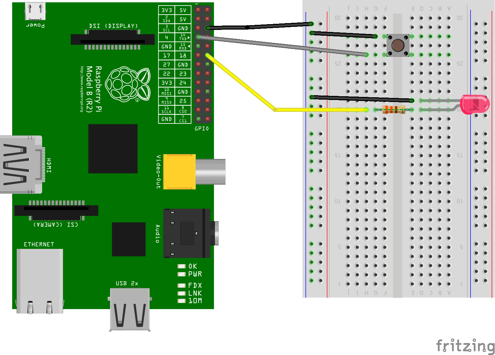

1. ## What is it?
  A Rapsberry Pi has a set of metal pins sticking out of the top of the board. The pins can be used to send signals to and from the computer and what's amazing is that they can be controlled by your programmes.

  You will need:
  * Raspberry Pi (any model) running Raspbian Jessie
  * Breadboard
  * 330 Ohm resistor X 1
  * A LED
  * Push Button Switch
  * Male-Female & Male-Male jump leads  
  

2. ## Your turn!
  **Let's build the circuit!**
  * Shutdown the Pi and remove power supply
  > ### Tip
  If your Pi does not contain labels for the pins, then the fantastic [Pi Leaf](https://www.raspberrypi.org/blog/raspberry-leaf/) is an easy and **free** aid to help you for this purpose.

  * Build the circuit shown on other side of this card by connecting _(this contains a number of steps so take your time to reduce chance of mistakes :D)_:
    * One of the **GND** pins to the _-/negative_ rail on the breadboard
    * **GPIO pin 4** to the _push button switch_ (it doesn't matter which side) and the other side of the switch to the _-/negative_ rail on the breadboard.
    * **GPIO pin 18** to the 330 ohm resistor which is connected to the positive leg of the **LED**. _The positive leg is the longer one_ (the negative leg is also the one on the same side as the flat end of the LED). Then connect the negative leg back to the _-/negative_ rail on the breadboard.
  * Reattach the power supply and turn on the Pi

  > ### Test your circuit!
  Once the Pi has powered up, test out the circuit and note down the answers to these questions:
   *  What happens when you press the button?
